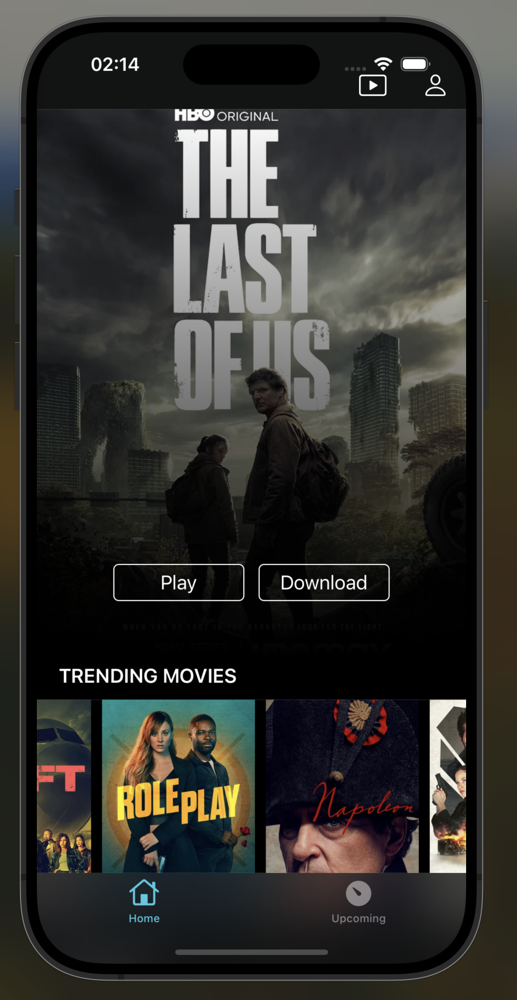
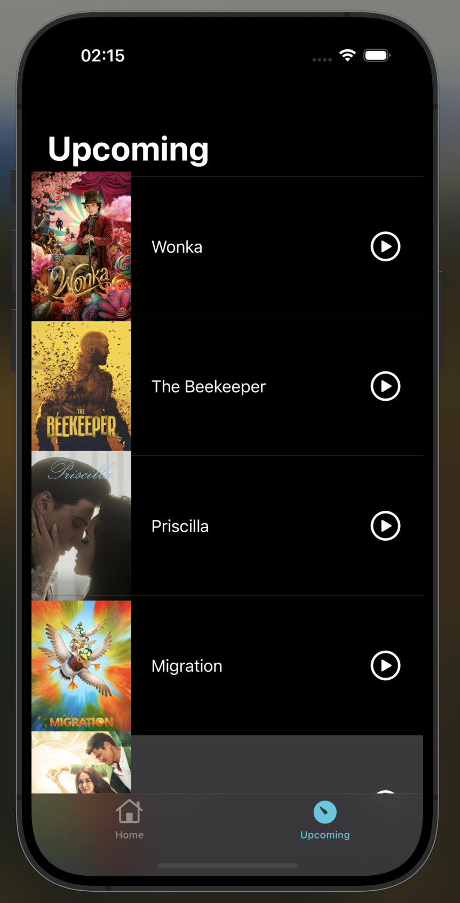

# LineFlixMovie

## Introduction
Welcome to **LineFlixMovie**, an innovative application platform designed to enhance your movie-watching experience. Developed using Swift and UIKit, LineFlixMovie offers a seamless and user-friendly interface for movie enthusiasts. Leveraging the robust The Movie Database (TMDB) API, we bring a vast collection of movies to your fingertips.

<table>
<tr>
  <td> </td>
  <td> </td>

  </tr>
<table>

## Technologies Used

The MovieApp is built using the following technologies:

- **Swift:** The programming language used to develop the iOS application.
- **UIKit Framework:** The iOS framework that provides the core components and functionalities for building the user interface.
- **SDWebImage:** An open-source library that simplifies the process of loading and caching remote images in iOS apps.
- **TMDb API:** The TMDb API (The Movie Database API) is used to fetch movie data, including details and images, to populate the app with up-to-date information.


## API Key Configuration

To access TMDB's content, a valid API key is required. Here's a brief guide:

1. **Obtain API Key**: Sign up or log in at [TMDB's website](https://www.themoviedb.org/settings/api) and request an API key under the API section in account settings.
2. **Configure in App**: In your LineFlixMovie project, locate the file where the API key is referenced and replace the placeholder with your obtained TMDB API key:
   ```swift
   static let API_KEY = "your_api_key_here" 

